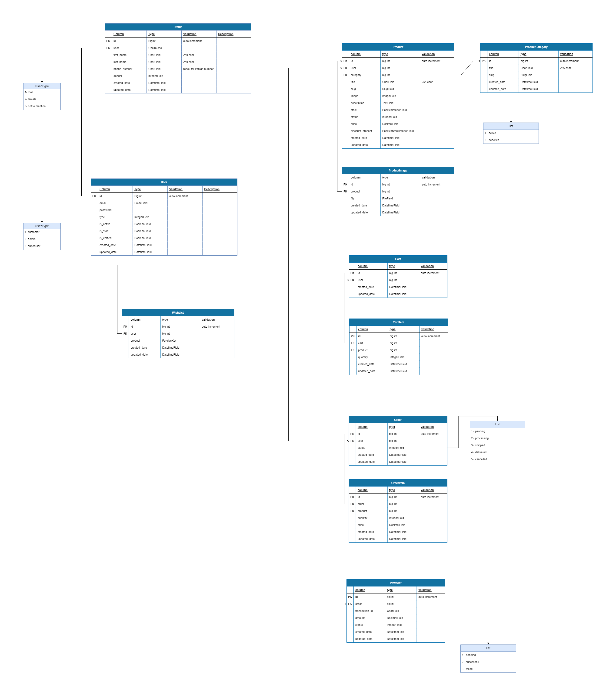

<h1 align="center">Django Shop</h1>

 
# Guideline
- [Guideline](#guideline)
- [Goal](#goal)
- [Demo](#demo)
- [Database Schema](#database-schema)
- [Curriculum](#curriculum)
- [License](#license)
- [Bugs](#bugs)

# Goal

This is a sample project to show you how to create a ecommerce website, and how to interact with users and payment gateway and also how to manage orders and products.

# Database Schema

the provided schema is the main database design of the project based on the models we have used in django project.

# License
MIT.

# HTML Template
 فایل مورد نظر برای پیاده سازی قالب فروشگاه در روت اصلی به صورت rar وجود دارد

